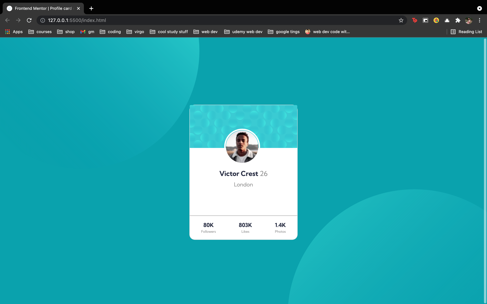

# Frontend Mentor - Profile card component solution

This is a solution to the [Profile card component challenge on Frontend Mentor](https://www.frontendmentor.io/challenges/profile-card-component-cfArpWshJ). Frontend Mentor challenges help you improve your coding skills by building realistic projects. 

## Table of contents

  - [The challenge](#the-challenge)
  - [Screenshot](#screenshot)
  - [Links](#links)
  - [Built with](#built-with)
  - [What I learned](#what-i-learned)
  - [Continued development](#continued-development)
  - [Author](#author)


### The challenge

- Build out the project to the designs provided

### Screenshot




### Links

- Solution URL: [Solution](https://github.com/moonbansal/profile-card-component)
- Live Site URL: [Live Site](https://profile-card-component-sigma-five.vercel.app)


### Built with

- Semantic HTML5 markup
- CSS custom properties
- Flexbox
- CSS positioning 


### What I learned


```css

body {
    background-image: url("images/bg-pattern-top.svg"), url("images/bg-pattern-bottom.svg");
    background-repeat: no-repeat, no-repeat;
    background-size: 700px, 750px;
    background-position: bottom 400px right 850px, top 450px left 850px;
    background-color: hsl(185, 75%, 39%);
    height: 790px;
    padding-top: 12.5rem;
}


.victor {
    border-radius: 50%;
    border: 0.3rem solid white;
    position: absolute;
    right: 110px;
    top: 70px;
}


.stats {
display: flex;
justify-content: space-around;
text-align: center;
font-weight: 700;
border-top: 0.5px solid hsl(0, 0%, 59%);
padding-top: 0.9rem;
color: hsl(229, 23%, 23%);
}
```

### Continued development

Flexbox, Grid and Positioning


## Author

- Website - [Moon Bansal](https://www.your-site.com)
- Frontend Mentor - [@moonbansal](https://www.frontendmentor.io/profile/moonbansal)


